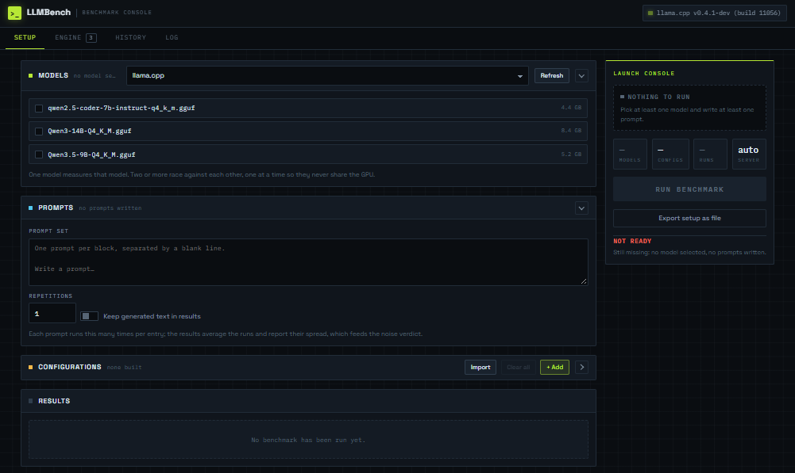
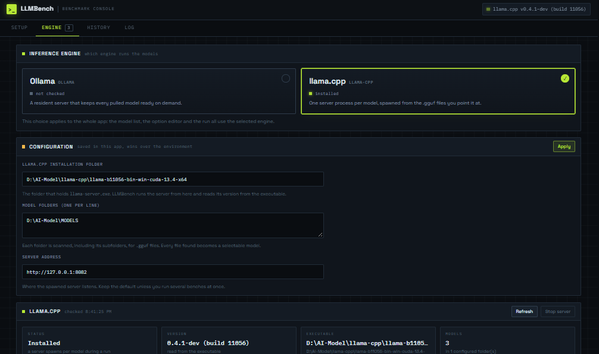
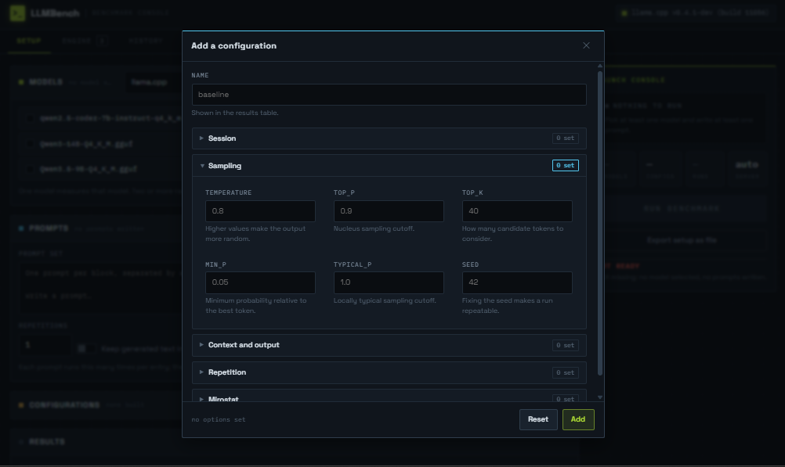

[](README.md) [](README.fa.md)

## LLMBench چیست

این ابزار (LLMBench) یک سیستمِ سنجشِ عملکرد (benchmark) برای مدل‌های زبانیِ لوکال است. مدل‌ها را روی مجموعه‌ای از promptها و کانفیگ ها اجرا می‌کند تا مقایسهٔ ممکن باشد، زمان‌ها را ثبت می‌کند، و مهم‌تر از همه قضاوت می‌کند: آن اختلافی که در خروجی می‌بینید، یک تفاوت واقعی است یا صرفا‌ً نوسانِ هر اندازه‌گیری.

اجرا روی دو موتور (runtime) پشتیبانی می‌شود:

- **Ollama** — مدل‌ها با یک تگ دانلود می‌شوند و یک سرورِ همیشگی آن‌ها را سرو می‌کند.
- **llama.cpp** — مدل‌ها فایل‌های `.gguf` روی دیسک شما هستند. برای هر مدل یک سرورِ جدا (`llama-server`) بالا می‌آید و با اتمام کار بسته می‌شود؛ یعنی هیچ سرویسی برای همیشه بالا نمی‌ماند. چیزی که از شما لازم است فقط این است که فایل‌ها روی سیستم موجود باشند و آدرس‌ها تنظیم شوند.


*نمای کلی برنامه: نوار بالا، ایستگاه‌ها، و بخش Setup در کنار هم.*

هر اجرا با **پروفایلش** ذخیره می‌شود: کدام موتور، در چه نسخه‌ای، روی چه دستگاهی (به‌همراه شناسهٔ GPU). این‌طوری هر عددی که ماه‌ها بعد در تاریخ می‌بینید، به همان موتور، نسخه و تنظیماتی که آن را ساخته‌اند بازمی‌گردد.

## چهار حالت مقایسه

نکته‌ای که LLMBench را ساده نگه می‌دارد این است که «حالت» را شما انتخاب نمی‌کنید؛ از چیزهایی که وارد می‌کنید به‌طور خودکار مشخص می‌شود. چهار حالت اصلی داریم:

1. **تست تک‌مدل** — یک مدل، بدون کانفیگِ اختصاصی. فقط می‌خواهید بدانید این مدل همین‌جا و همین‌طور که هست، چقدر سریع است.
2. **مقایسهٔ کانفیگ‌ها** — یک مدل، چند کانفیگ. مثلا‌ً همین مدل با 999 لایهٔ GPU در برابر 32 لایه؛ یا با و بدون flash-attention. این در واقع تستِ خودِ کانفیگ‌هاست و می‌گوید کدام تنظیمات برای همان مدل بهتر جواب می‌دهد.
3. **مقایسهٔ مدل‌ها** — چند مدل، یک تنظیم. وقتی می‌خواهید بدانید برای همین کاربرد، کدام مدل سریع‌تر است.
4. **حالت مسابقه‌ای (Tournament)** — چند مدل و چند کانفیگ. هر مدل با کانفیگی که زیر آن قرار است رقابت کند جفت می‌شود؛ کامل‌ترین شکل مقایسه.

### چطور این کار را انجام می‌دهید

همهٔ این حالت‌ها از یک فرم واحد شروع می‌شوند؛ فقط مدل‌ها و کانفیگ‌هایی که انتخاب می‌کنید فرق می‌کند:

- مدل‌ها را از فهرست تیک بزنید (یکی = حالت ۱ یا ۲، چندتایی = حالت ۳ یا ۴).
- promptها را بنویسید (هر prompt در یک بلاک، با خطِ خالی از بقیه جدا).
- در صورت نیاز کانفیگ بسازید یا یک فایل کانفیگ وارد کنید.
- تعداد تکرارها را تنظیم کنید (پیش‌فرض ۱) و روی Run بزنید.

**قبل از شروع، موتور باید در دسترس باشد:**

- برای **Ollama**: اول Ollama روی سیستم نصب و سرورش بالا باشد (یا از داخل خودِ برنامه start شود).
- برای **llama.cpp**: نیازی به نصبِ سرویس نیست؛ کافی است فایل‌های `llama-server` و مدل‌های `.gguf` روی سیستم باشند و در ایستگاهِ موتور، آدرسِ پوشهٔ نصب و آدرسِ پوشهٔ(های) مدل را تنظیم کنید. برنامه خودش سرور را برای هر مدل بالا می‌آورد.


*تب Engine: انتخابگرِ موتور، بلوکِ تنظیماتِ مسیرها، کارت‌های وضعیت، و فهرستِ مدل‌های پیدا‌شده.*


*صفحه اضافه کردن کانفیگ*

## آنچه اندازه گرفته می‌شود

هر اندازه‌گیری یک prompt را یک‌بار از سر تا پا ثبت می‌کند و چندین عدد از آن به دست می‌آید:

- **سرعت پردازش پرامپت** (prompt / prefill speed) — چند توکن از ورودی در ثانیه پردازش می‌شود.
- **سرعت تولید توکن** (generation speed) — چند توکن خروجی در ثانیه ساخته می‌شود. این همان عدد اصلی «سرعت مدل» است.
- **زمان اولین توکن** (Time to First Token، TTFT) — چقدر طول می‌کشد تا اولین خروجی بیفتد.
- **مدت کلِ هر اندازه‌گیری** (duration) — کلِ زمانِ همان یک اجرا، برحسب ثانیه.
- به‌علاوه، هر اندازه‌گیری یک اسنپ‌شات از دستگاه می‌گیرد: **حافظهٔ VRAM مصرفی**، **دمای GPU** و **کلاکِ GPU** — تا بدانید مدل در حال کار روی دستگاه چه کار می‌کند.

### تکرار و تشخیص نویز

یک اندازه‌گیریِ تکی قابل اعتماد نیست؛ هر prompt می‌تواند چند بار اجرا شود (تعداد تکرارها). نتیجه، میانگینِ این اجراهاست و **انحراف معیار** (standard deviation) آن‌ها هم به‌عنوان معیارِ پراکندگی ثبت می‌شود — هرچه انحرافِ معیار کمتر باشد، عدد مطمئن‌تر است.

بیشتر از آن، LLMBench یک **قضاوتِ معناداری** می‌دهد: اختلافِ دو نمونهٔ برتر را با همان نویزِ اندازه‌گیری‌شده (انحرافِ معیار) می‌سنجد و می‌گوید:

- «تفاوت واقعی است — برترِ A به اندازهٔ X از B سریع‌تر است و از نویز عبور می‌کند»، یا
- «تفاوت در حد نویز است؛ نمی‌توان گفت کدام واقعا‌ً بهتر است»، یا
- صادقانه، وقتی هر ورودی فقط یک‌بار اندازه‌گیری شده باشد: «برای قضاوت باید تکرار را بیشتر کنید.»

https://github.com/user-attachments/assets/ad4e82bb-2029-4a42-b33b-74792f2715a7

*خروجیِ یک اجرا: جدولِ مقایسه با ستون‌های سرعت، قضاوتِ معناداری، و خوانشِ دستگاه.*

## نصب و راه‌اندازی

نیازها: Python 3.10 به‌بالا، و یکی (یا هر دو) از موتورهای بالا. درایور NVIDIA با `nvidia-smi` روی PATH اختیاری است — اگر نباشد، ستون‌های GPU خالی می‌مانند و بقیهٔ اندازه‌گیری‌ها بدون مشکل ادامه می‌یابند.

```bash
pip install -r requirements.txt
python app.py
```

سپس <http://127.0.0.1:5000> را باز کنید. برای تنظیم آدرس‌ها می‌توانید یا در همان **ایستگاهِ موتور** از داخل برنامه واردشان کنید (که در `settings.json` ذخیره می‌شود و روی متغیرهای محیطی اولویت دارد)، یا از متغیرهای محیطی استفاده کنید:

| متغیر | موتور | معنا |
| --- | --- | --- |
| `OLLAMA_HOST` | Ollama | آدرسِ API (پیش‌فرض `http://127.0.0.1:11434`) |
| `LLAMA_CPP_HOME` | llama.cpp | پوشه‌ای که `llama-server.exe` در آن است |
| `LLAMA_CPP_MODELS` | llama.cpp | پوشهٔ(های) مدل — به‌صورت بازگشتی برای فایل `.gguf` اسکن می‌شود |
| `LLAMA_CPP_HOST` | llama.cpp | آدرس سروری که برنامه بالا می‌آورد (پیش‌فرض `http://127.0.0.1:8082`) |

## تاریخچه

هر اجرا به‌صورت خودکار در تاریخچه ثبت می‌شود (جدیدترین در بالا، تا سقف ۱۰۰ مورد) و همراه با پروفیلش می‌ماند — تا بتوانید هر عدد را به دستگاه، موتور و تنظیماتی که آن را ساخته‌اند ردیابی کنید.

---

---

ایدهٔ LLMBench در جریان طراحی و توسعهٔ [ModelSetupHub](https://github.com/ModelSetupHub/ModelSetupHub) شکل گرفت. این ایده حاصل همکاری و تبادل نظر من و [Parsa Safaie](https://github.com/parsasafaie) بود و بخشی از ایدهٔ اولیه و قابلیت‌های LLMBench نیز از پیشنهادها و طراحی‌های مشترک ما شکل گرفتند.

LLMBench یک پروژهٔ مستقل با تمرکز مشخص‌تر بر benchmark، تکرارپذیری اندازه‌گیری‌ها و تحلیل معناداری نتایج است.

---
